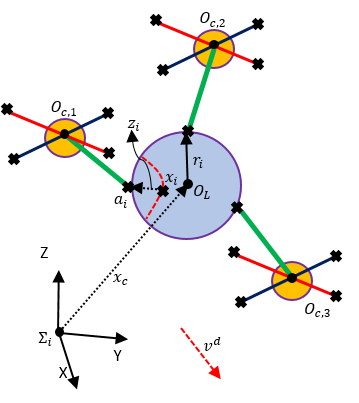
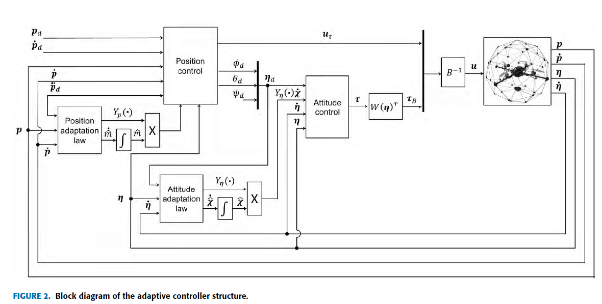
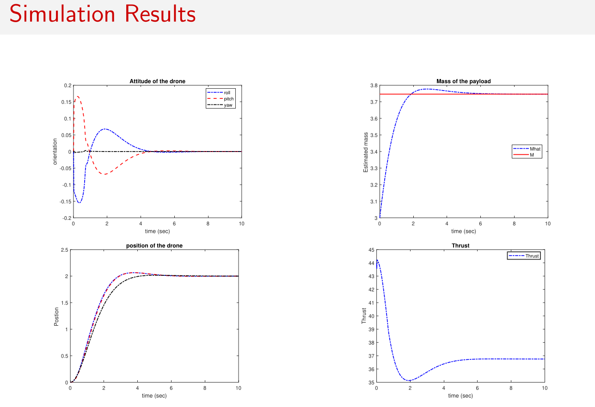
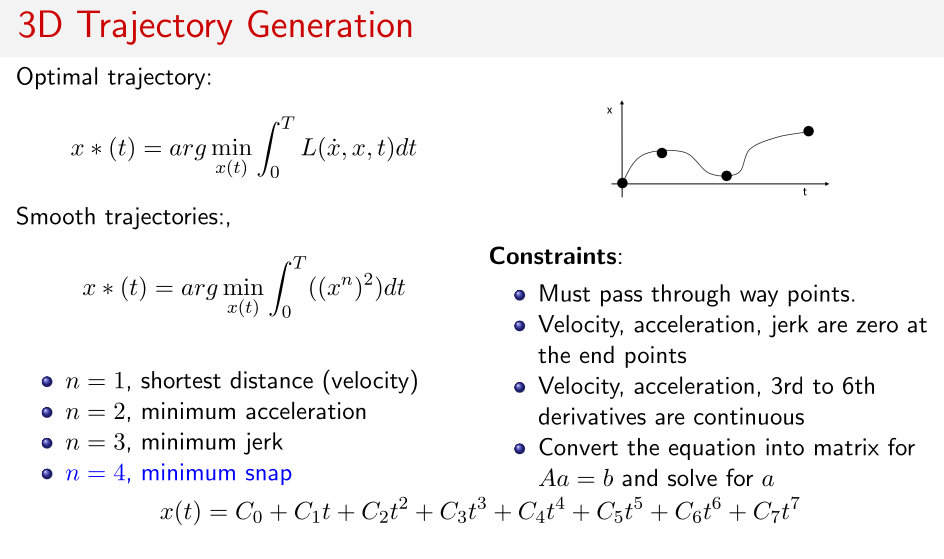
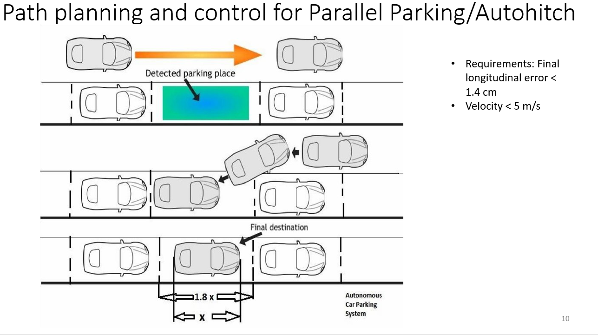
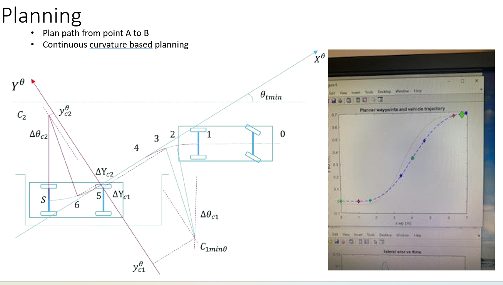
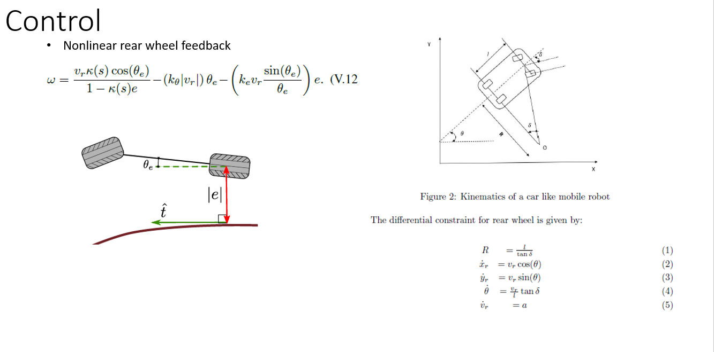
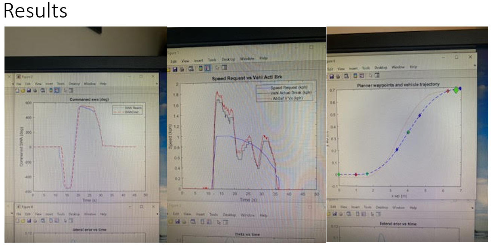
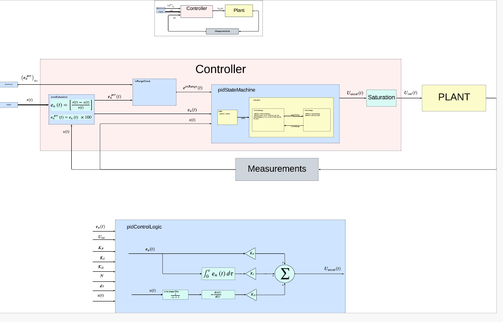

I’m a **Robotics Controls Engineer** passionate about building intelligent, reliable, and safe autonomous systems. My interests lie at the intersection of **nonlinear control, hybrid systems, and optimization**, with applications across UAVs, autonomous vehicles, and robotics. I specialize in designing **provably safe control and planning/learning algorithms** from the ground up—leveraging tools from control theory, vehicle dynamics, and learning-based methods to solve real-world challenges in autonomous navigation, flight control, and decision-making.

- **Research Focus:** Controls, Robotics, Learning, and Autonomy
- **Languages:** C/C++, MATLAB/Simulink, Stateflow, Python
- **Platforms:** **ROS**, **dSPACE**, MicroAutoBox II, **Raspberry Pi**, Jetson-TX2, VCU, ECU Scalexio, CANape, CANalyzer, **PX4-Autopilot**, UDP Ethernet, CANdb++, QGroundControl, PX4-SITL
- **Research Interest:** Provavly safe control and motion planning of autonomous systems, decision making under uncertainty, distributed control and estimation, multi-vehicle coordination and control, aerial robotics,

---

# Related Work (Portfolio)
---

Table of Contents
* Auto generated table of contents
{:toc}

---

## Distributed Control and Manipulation 
Part of M.S Research Work at Oklahoma State with Dr. He Bai at OSU. Joint work with Dr. Acosta from U of Seville, Spain. 

** Relevant Publications: ** 
* **[J2.] Thapa S.**, Bai H. and Acosta J.A. *Cooperative Aerial Manipulation with Decentralized Adaptive Force-Consensus Control*. Journal of Intelligent & Robotic Systems, Jan, 2020
* **[C1.] Thapa S.**, Bai H. and Acosta J.A. *Cooperative Aerial Load Transport with Attitude Stabilization*. 2018 American Control Conference (ACC).
* **[C2.] Thapa S.**, Bai H. and Acosta J.A. *Force Control in Cooperative Aerial Manipulation*. IEEE International Conference on Unmanned Aircraft Systems (ICUAS), June 12-15, 2018
* **[C3.] Thapa S.**, Bai H. and Acosta J.A. *Cooperative Aerial Load Transport with Force Control*. IFAC Workshop on Networked & Autonomous Air & Space Systems, June 12-14, 2018

### Cooperative Control of Unknown Payload, Adaptive Control and Consensus Control.  
<video width="100%" controls autoplay loop muted>
  <source src="../images/KnownMass5.mp4" type="video/mp4">
  Your browser dht="315" 
  src="https://www.youtube.com/embed/lgTVWmbpyd0" 
  title="YouTube video player" 
  frameborder="0" 
  allow="accelerometer; autoploes not support the video tag.
</video>

### Cooperative Attitude Control 
<video width="100%" controls autoplay loop muted>
  <source src="../images/Anim_new_control.mp4" type="video/mp4">
  Your browser dht="315" 
  src="https://www.youtube.com/embed/lgTVWmbpyd0" 
  title="YouTube video player" 
  frameborder="0" 
  allow="accelerometer; autoploes not support the video tag.
</video>

  <iframe width="560" height="315" 
  src="https://www.youtube.com/embed/tDgRc_d6Nqo" 
  title="Autonomous Flight Control Implementation Example" 
  frameborder="0" 
  allow="accelerometer; autoplay; clipboard-write; encrypted-media; gyroscope; picture-in-picture; web-share" 
  allowfullscreen>
  </iframe>

## Learning Based Control and Estimation 
Cooperative Manipulation of an Unknown Payload with Concurrent Mass and Drag Force Estimation. Published in IEEE Control System Letters , 2019. Joint with Dr. Kamalapurkar at OSU, currently at UF. 

* **[J1.] Thapa S.**, Self R., Bai H. and Kamalapurkar, R. *Cooperative Manipulation of an Unknown Payload with Concurrent Mass and Drag Force Estimation.* IEEE Control Systems Letters (L-CSS) with an option to present in CDC, 2019.

### Drag Force Estimation 

### Contact Force Acting on the Payload 

### Simulation with Time-Varying Velocity 
<video width="100%" controls autoplay loop muted>
  <source src="../images/LSS_2019_TimeVarVelocity.mp4" type="video/mp4">
  Your browser does not support the video tag.
</video>

### Non-linear Adaptive Geometric Control 

## Aerial Manipulator Design 

### Aerial Manipulator Flight Test 
<iframe width="560" height="315" src="https://www.youtube.com/embed/vBqVEjUz4NM" frameborder="0" allow="accelerometer; autoplay; encrypted-media; gyroscope; picture-in-picture" allowfullscreen></iframe>

#### Aerial Manipulator Design

  <iframe width="560" height="315" 
  src="https://www.youtube.com/embed/lgTVWmbpyd0" 
  title="Aerial Manipulator Design" 
  frameborder="0" 
  allow="accelerometer; autoplay; clipboard-write; encrypted-media; gyroscope; picture-in-picture; web-share" 
  allowfullscreen>
  </iframe>

## Autonomous Control of UAV 

### State Dependent LQR for Autonomous Trajectory Tracking of Quadrotor UAV 
Designed and implemented full state time varying LQR and implemented in real-time Gazebo and PX4

<video width="100%" controls autoplay loop muted>
  <source src="../images/LQR_control.mp4" type="video/mp4">
  Your browser does not support the video tag.
</video>

### Quadrotor UAV Cascaded PID Control in PX4 
<video width="50%" controls autoplay loop muted>
  <source src="../images/PX4_PID_Control.mp4" type="video/mp4">
  Your browser does not support the video tag.
</video>

###  Offboard Velocity Control 
<video width="100%" controls autoplay loop muted>
  <source src="../images/offboard_velocity_px4_gazebo.mp4" type="video/mp4">
  Your browser does not support the video tag.
</video>

### 3D Trajectory Generation of UAV  

<video width="100%" controls autoplay loop muted>
  <source src="../images/Minimum_Snap_Trajectory_Generation_Simulation.mp4" type="video/mp4">
  Your browser does not support the video tag.
</video>

## Autonomous Vehicle Planning and Control 

### Path Planning Based on Clothoid

### Non-linear Rear Wheel Feedback Based Control 

### Vehicle Dynamics with Cruise Control and Lateral Control 
<video width="100%" controls autoplay loop muted>
  <source src="../images/Vehicle_Dynamics_and_Cruise_Control.mp4" type="video/mp4">
  Your browser does not support the video tag.
</video> 

### Pure Pursuit Based Control 
<video width="100%" controls autoplay loop muted>
  <source src="../images/pure_pursuit.mp4" type="video/mp4">
  Your browser does not support the video tag.
</video> 

## Safety Embedded Control 
Safety Embedded PID Control for Robotics and Automation. Work in Progress. 

### Bio / Context 

I'm a Controls Engineer for robotics, autonomous vehicles and UAVs. I love designing safe critical control and planning algorithms from the ground up using tools from control theory, optimization, vehicle dynamics, robotics, learning, and planning. I'm interested in the intersection of theory and applications. I enjoy developing practical and safe algorithms and apply them to solve real problems in autonomous vehicle controls, flight controls, navigation, decision making, autonomy, and robotics. I have developed, implemented and published various trajectory tracking control and planning and coordination algorithms for both multi-rotors and mobile robots/vehicles using LQR, PID, MPC, Adaptive, Nonlinear, Path planning based on clothoids, differential flatness, splines and so on using C++, Python, ROS/Gazebo, MATLAB/Simulink both in simulation and real-time system using PX4, dSpace, C++/ROS.

I received my Masters in Mechanical and Aerospace Engineering at Oklahoma State University working under Dr. He Bai at the CoRAL Lab from Aug 2016 to Dec 2018. I worked very closely with Dr. Rushikesh Kamalapurkar (currently at UF) and J.Á. Acosta at Universidad de Sevilla (Spain). 

During my M.S. I worked on Aerial robotics and Control with focus on cooperative aerial manipulation and control of multi-agents. We published 3 peer-reviewed conference paper and 2 journals

### Current Research Interest 

My interest lies in the intersection of control, planning, learning for autonomous systems. I’m interested in the balance between theoretical analysis and practical implementation on hardware systems in a multi-disciplinary environment. My overall goal is to be a full stack controls and robotics researcher using tools ranging from control design, autonomous planning, decision making and implementation on real-time hardware systems. 

In general I'm interested in both deep theoretical foundations and practical applications.

- Control and planning of autonomous systems, nonlinear, adaptive and optimal control

- Distributed Controls and Estimation

- Multi-vehicle coordination and control

- Trajectory optimization and motion planning 

- Aerial Robotics and Robot Autonomy 

- Planning/Decision making under uncertainty 

### Education

### M.S. in Mechanical & Aerospace Engineering, Oklahoma State University, 2018
   * Robotics & Controls 

### B.S. in Mechanical Engineering, McNeese State University, 2015
   * Mechanical Engineering 
  

### Work Experience
### Technical Lead, Controls Software
**Amogy INC**, Brooklyn, NY | *Aug 2022 – Present*

* Control Algorithms development, testing, and validation of the fully autonomous Amogy System.
* Developed novel **PID Control Algorithms** for trajectory tracking that reduce actuator chattering and account for sensor error accuracy.
* Lead Controls Engineering including Hardware & Software Development, Controls Algorithms, State Machine Development, and Network Architecture.
* Developed advanced control algorithms: **Nonlinear control, Hybrid controls, Filter design, and Model Predictive Control (MPC)**.
* Designed advanced networking for redundancy, communications, and data processing.
* Designed HMI systems and implemented noise reduction, filtering, and fault management.
* Developed data structures to integrate different devices for advanced communication, control, and HMI.
* Configured and integrated communication protocols (CAN, Ethernet TCP, Modbus TCP).
* Spearheaded hardware design, including VCU, **Raspberry Pi**, and dSPACE systems.
* Guided a multidisciplinary team, ensuring compliance with **functional safety standards**.
* Advise and mentor junior controls, HIL, embedded, and electrical engineers.
* **Tools:** C/C++, Python, MATLAB, CAN, CANape, CANalyzer, dSPACE, Code Generation, TCP/IP Networking.

### Research Engineer (Autonomous Driving - Planning and Controls)
**Ford Motor Company**, Dearborn, MI | *Jan 2021 – Jun 2022*

* Research in advanced controls and planning; designed low-speed path planning and control algorithms for autonomous parallel parking, auto-hitch, nudge maneuvers, state machines, and V2V localization/collision-avoidance.
* Designed and implemented a **continuous curvature-based path planner** and **nonlinear rear-wheel feedback lateral controller** for auto-hitch and parallel parking (L2 autonomy).
* Created state machines for complex state transitions and management during parking and auto-hitch maneuvers.
* Created **Vehicle-to-Vehicle (V2V) networking** and TCP/IP UDP data interfaces for real-time data streaming between multiple Ford vehicles for localization and collision avoidance.
* Conducted testing, validation, and refinement of autonomous driving features.
* **Tools:** Simulink, Stateflow, ROS, C/C++, TCP/IP, dSPACE, CANape, CANalyzer.

### Senior Controls Engineer, Autonomy
**The Drone Racing League**, New York, NY | *Jul 2019 – Jan 2021*

* Led research, development, and implementation of control algorithms for autonomous drones, focusing on position and attitude control for trajectory tracking.
* Designed and implemented advanced control strategies, including **State-Dependent LQR, LQR/LQG, Nonlinear PID, Adaptive Control (MRAC), Geometric Control, and MPC**, ensuring robust trajectory tracking and attitude stabilization.
* Developed and analyzed trajectory tracking performance using ROS/Gazebo and PX4 SITL simulations with PID and LQR controllers.
* Implemented solvers for **Algebraic Riccati Equations in C++** to support control algorithm development.
* Conducted real-time flight testing, algorithm testing, and debugging for autonomous flight.
* **Tools:** C/C++, ROS, PX4, Gazebo, Eigen, CMake, Python, MATLAB/Simulink.
### Robotics Controls Engineer - March 2019- July 2019 
  * Deka Research and Development , Manchester, NH 
  * Autonomous robots offline path planning and controls
  
### Updates 
- 

###  Other Interests 

# Email: thapasandesh1@gmail.com