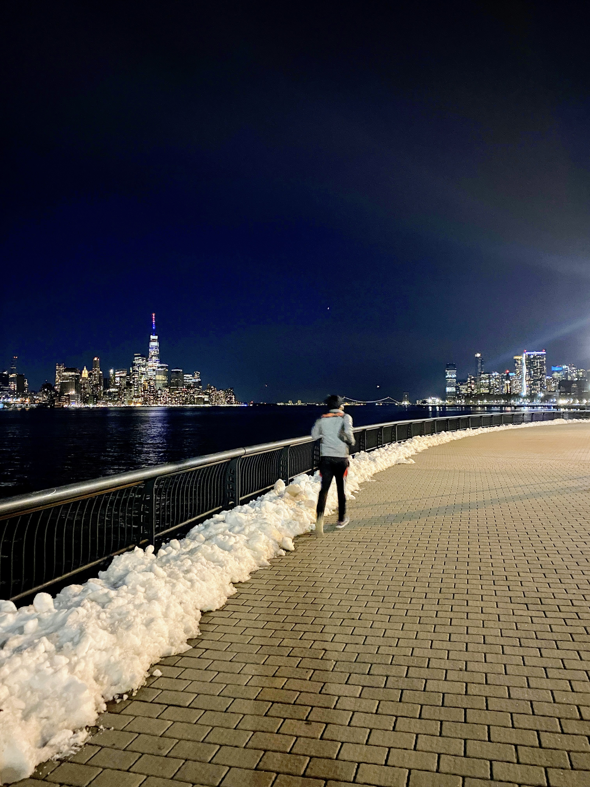
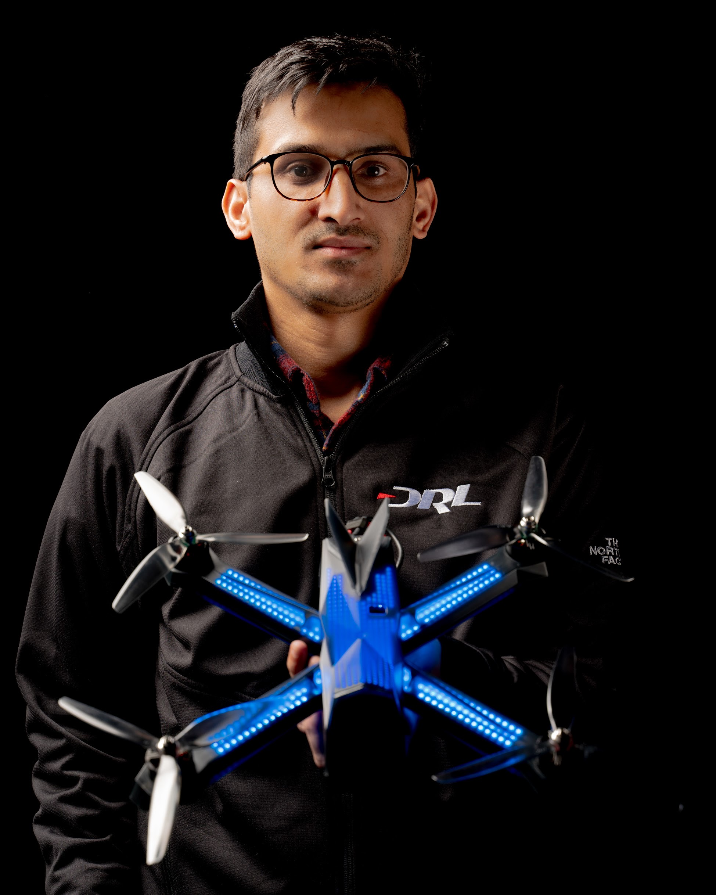

I'm a Robotics Controls Engineer for autonomous vehicles and UAVS. I love designing intelligent control and planning algorithms from ground up using tools from control theory, optimization, vehicle dynamics, robotics, learning and planning. I'm interested in the intersection of theory and applications. I enjoy developing practical and safe algorithms and apply them to solve real problems in autonomous vehicle controls, flight controls, navigation, decision making, autonomy and robotics. I have developed, implemented and published various trajectory tracking control and planning and coordination algorithms for both mutli-rotors and mobile robots/vehicles using LQR, PID, MPC, Adaptive, Nonlinear, Path planning based on clothoids, differential flatness, splines and so on using C++, Python, ROS/Gazebo, MATLAB/Simulink both in simulation and real time system using PX4, dSpace, C++/ROS.

I'm always willing to learn more about autonomous controls, planning and decision making and autonomy in general. If you have interesting ideas be it in autonomous flight controls or autonomous vehicles, feel free to shoot me a message or an email.

- Robotics Controls Engineer: UAVS, Autonomous Vehicles, Robotics
- Platform: multirotors, fixed wing uav, mobile robots, self-driving cars, autonomous vehicles
- Software skills: C/C++, Python, ROS, MATLAB/Simulink, PX4, Gazebo, Git

# Bio 
I received my Masters in Mechanical and Aerospace Engineering at Oklahoma State University working under Dr. He Bai at the CoRAL Lab from Aug 2016 to Dec 2018.  

During my M.S. I worked on Aerial robotics and Control with focus on cooperative aerial manipulation and control of muti-agents. We published 3 peer-reviewed conference paper and 2 journal

# Related Work
## LQR Control of Quadrotor UAV 
<iframe width="560" height="315" src="https://www.youtube.com/embed/eFBT57DQ0kM" frameborder="0" allow="accelerometer; autoplay; encrypted-media; gyroscope; picture-in-picture" allowfullscreen></iframe>

## Cooperative Control 
<iframe width="560" height="315" src="https://www.youtube.com/embed/NlLO4DQXdJ0" frameborder="0" allow="accelerometer; autoplay; encrypted-media; gyroscope; picture-in-picture" allowfullscreen></iframe>

## Planning of UAV  
<iframe width="560" height="315" src="https://www.youtube.com/embed/agyWXUrk49U" frameborder="0" allow="accelerometer; autoplay; encrypted-media; gyroscope; picture-in-picture" allowfullscreen></iframe>

### Pure Pursuit Based Control 
<iframe width="560" height="315" src="https://www.youtube.com/embed/ScN-rJQIC24" frameborder="0" allow="accelerometer; autoplay; encrypted-media; gyroscope; picture-in-picture" allowfullscreen></iframe>

# Current Research Interest 

My  interest lies in the intersection of control, planning, learning for autonomous systems. I’m interested in the balance between theoretical analysis and practical implementation on hardware systems in a multi-disciplinary environment. My overall goal is to be a full stack controls and robotics researcher using tools ranging from control design, autonomous planning, decision making and implementation on real-time hardware systems. 

In general I'm interested in both deep theoretical foundations and practical applications.

- Control and planning of autonomous systems, nonlinear, adaptive and optimal control

- Distributed Controls and Estimation

- Multi-vehicle coordination and control

- Trajectory optimization and motion planning 

- Aerial Robotics and Robot Autonomy 

- Planning/Decision making under uncertainty 

# Education
### B.S. in Mechanical Engineering, McNeese State University, 2015
   * Mechanical Engineering 
  
### M.S. in Mechanical & Aerospace Engineering, Oklahoma State University, 2018
   * Robotics & Controls 

# Work experience
### Technical Lead, Controls Engineering - Dec 2023 - Present
  * Amogy INC, Brookyln, NY 
  * Lead control engineering across PD and R&D with 10+ Engineers 
  * Lead Controls Algorithms Development, State Machine Development, HMI Development 
  * PID Control, Hybrid Control, Filtering, State Transitions and Autonomy 
  * Developed novel PID Control Algorithms for trajectory tracking that reduce actuator chattering and account for sensor error accuracy. 
  * Noise and filter design 
  * Feedback control, Feed-forward control, state-dependent control 
  * Robust fault management algorithm development
  * HMI Development 
  * Automated HMI development in C Programming
  * Programming in Simulink, C/C++, Python 
  * CAN, Ethernet TCP, Modbus TCP networking Development
  * VCU, dSpace, Raspberry PI, MircoController, CANape
  * Lead Controls Hardware, Architecture Development 
  * Lead the Control Hardware Selection that satisfies the functional safety 
  * Advise and mentor junior controls, hil, embedded engineer 
  * Hardware in the Loop Development

### Senior Controls System Engineer  - Aug 2022- Dec 2023 
  * Amogy INC, Brookyln, NY 
  * Lead control engineering across PD and R&D with 10+ Engineers 
  * Controls System Design 
  * Controls and Autonomous Systems 
  * State Machine Design and Development 
  * Hardware in the Loop ( HIL) with dSpace 
  * Model and Software in the Loop Development
  * Data Analysis 
  * Networking & Communication ( CAN, Ethernet UDP) 
  * HMI Development 
  * Embedded Systems 

###  Senior Vehicles Motion Controls Engineer, Autonomous Vehicles - Jan 2021 - June 2022 
  * Ford Motor Company, Dearborn, MI. 
  * Vehicle motion control for low speed controls and planning 
  
### Senior Flight Controls Engineer, Autonomy - July 2019- Jan 2021
   * Drone Racing League (DRL), New York, NY 
   * Autonomous Drones controls and planning algorithms design and implementation. 

### Robotics Controls Engineer - March 2019- July 2019 
  * Deka Research and Development , Manchester, NH 
  * Autonomous robots offline path planning and controls
  
# Updates 
- 

# Other Interests 

# Email: thapasandesh1@gmail.com
