I am a **robotics and controls research engineer** working on **safety-critical control and motion planning for robots and multi-agent systems**. My work pairs rigorous control theory with hands-on validation on real hardware, driven by one conviction: **safety is the central bottleneck in deploying physical AI** — for a single robot and, even more so, for teams of them that must stay safe while coordinating.

A recurring gap in safety-critical control lies between **formal, state-space guarantees** — control barrier functions, Hamilton–Jacobi reachability, predictive safety filters — which assume an analytical model and idealized actuators, and the **actuator-level methods** used in real deployments — input bounding, anti-windup, bumpless transfer — which carry no such guarantees. Real robots, bound by hard safety limits and by uncertain or partially known dynamics, need both — and the challenge compounds when many agents share an environment. I am interested in **guaranteeing end-to-end safety, from a single robot to a multi-agent team, using reduced-order or uncertain models — under bounded model uncertainty and unmodeled dynamics — at a computational cost light enough for real-time embedded hardware**.

**Research interests**
- Safety-critical control and motion planning for robots and multi-agent systems
- Distributed and decentralized control, estimation, and multi-vehicle coordination
- Composing actuator-level and state-space safety guarantees under model uncertainty
- Nonlinear, adaptive, and optimal control; control barrier functions and reachability
- Learning and decision making under uncertainty; trajectory optimization and planning

I am currently a **Visiting Researcher** in the [ETAIC Lab](https://etaic.github.io/members/) at the University of Texas at Arlington (host: Dr. H. Eric Tseng, NAE Member), and I am applying to PhD programs in controls and robotics.

See my [publications](/publications/), [research](/research/), and [CV](/cv/) for details.
---

## Selected Research & Projects

* Auto-generated table of contents
{:toc}

### Safety-Critical Control (CBFs and Safety Certificates - Current Research)

**Safety-critical control — current directions**
- Safety certificates for low-level control loops 
- Safety-critical control for multi-agent systems
- Safe control in the presence of uncertainty

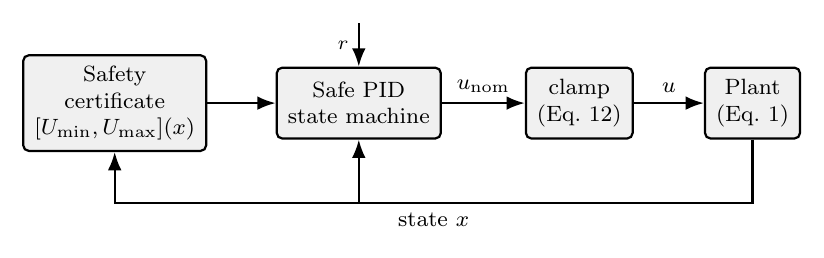
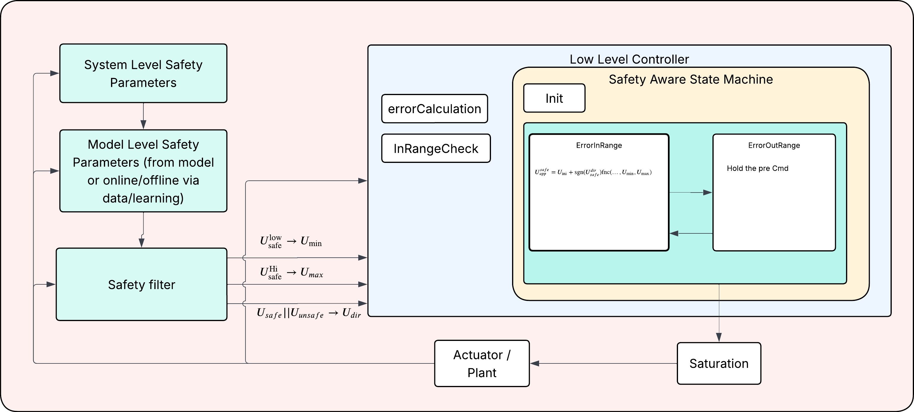
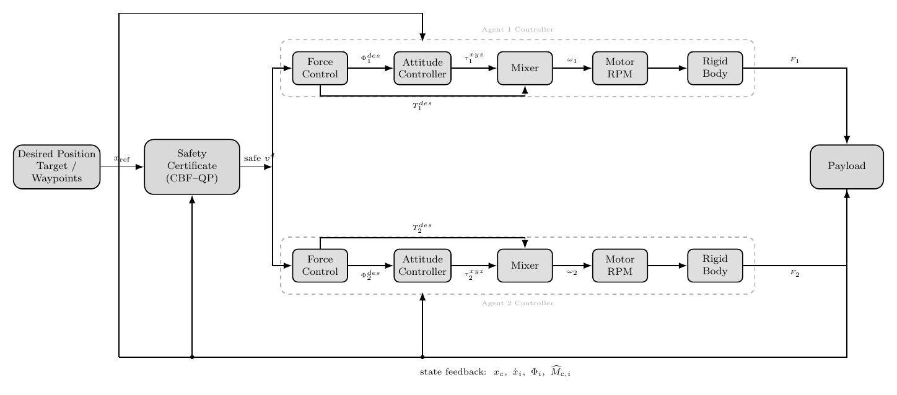
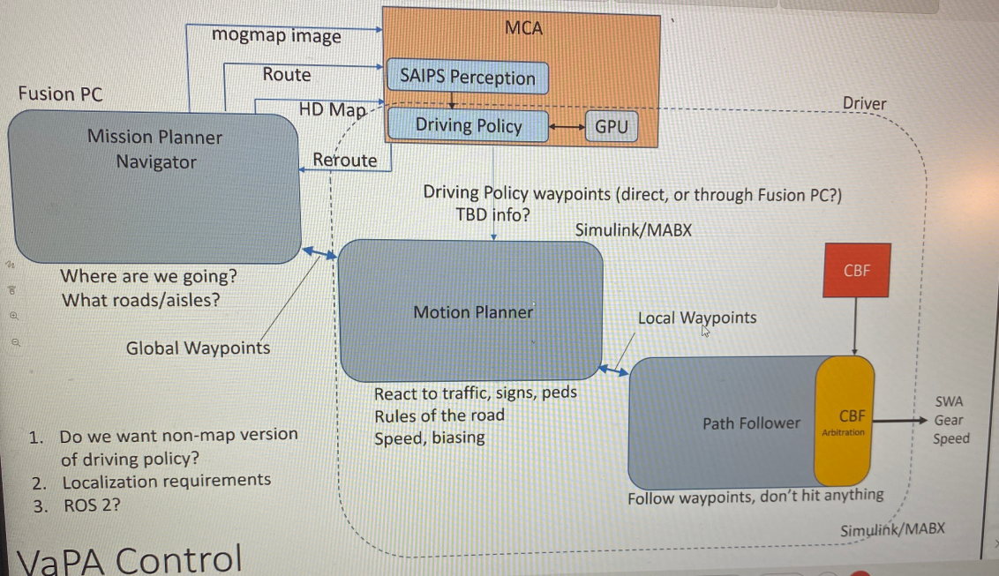

### Autonomous Quadrotor UAV Control
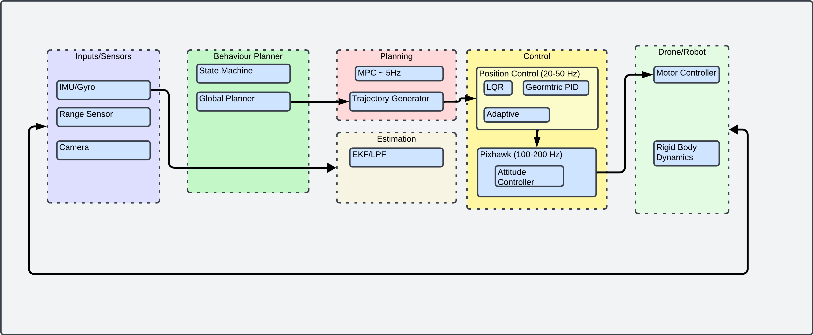

* Cascaded PID, state-dependent LQR, nonlinear Lyapunov-based, sliding-mode, backstepping, geometric SE(3), and Cartesian impedance controllers for quadrotor trajectory tracking.
* Geometric attitude control and differential-flatness-based minimum-snap trajectory generation.
* End-to-end autopilot integrating state estimation, planning, and control, validated in MATLAB/Simulink, Gazebo, PX4 SITL, ROS, and on real quadrotor hardware.

#### Cascaded PID Control in PX4
<video width="100%" controls autoplay loop muted>
  <source src="../images/PX4_PID_Control.mp4" type="video/mp4">
  Your browser does not support the video tag.
</video>

#### State-Dependent LQR for Trajectory Tracking
Full-state time-varying LQR designed and implemented in real time in Gazebo and PX4.

<video width="100%" controls autoplay loop muted>
  <source src="../images/LQR_control.mp4" type="video/mp4">
  Your browser does not support the video tag.
</video>

#### Offboard Velocity Control
<video width="100%" controls autoplay loop muted>
  <source src="../images/offboard_velocity_px4_gazebo.mp4" type="video/mp4">
  Your browser does not support the video tag.
</video>

#### Minimum-Snap 3D Trajectory Generation
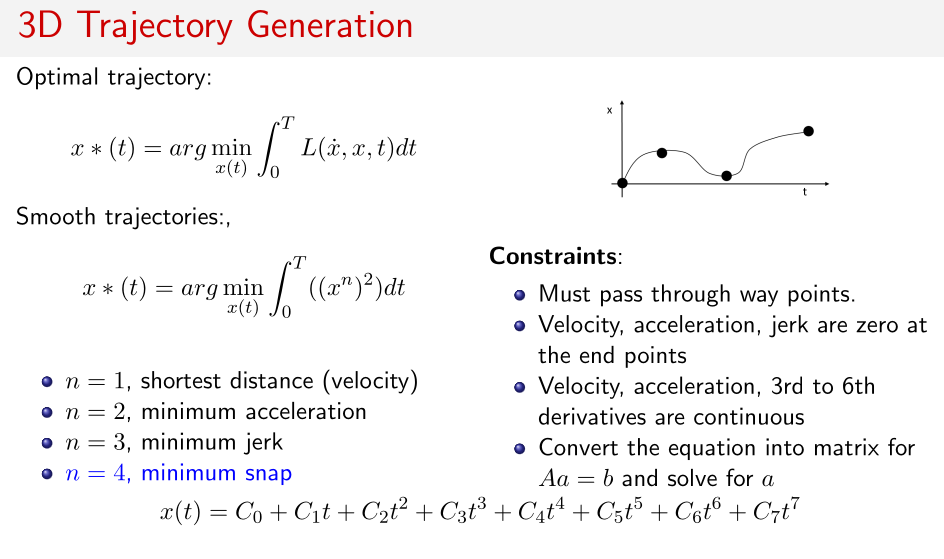

<video width="100%" controls autoplay loop muted>
  <source src="../images/Minimum_Snap_Trajectory_Generation_Simulation.mp4" type="video/mp4">
  Your browser does not support the video tag.
</video>

### Distributed Control, Coordination, and Manipulation
M.S. research at Oklahoma State University with Dr. He Bai (CoRAL Lab), jointly with Dr. J. Á. Acosta (University of Seville, Spain).

* Decentralized multi-robot control framework for cooperative aerial manipulation: multiple quadrotor UAVs transport a shared payload **without constant inter-robot communication**.
* Adaptive force-sharing controllers regulate payload forces while all agents coordinate their motion, with stable transport under unknown payload mass and external disturbances — validated in simulation and physical flight tests.

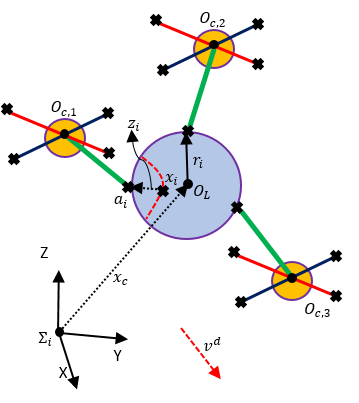

**Related publications:**
* **[J2]** Thapa S., Bai H., Acosta J.A. *Cooperative Aerial Manipulation with Decentralized Adaptive Force-Consensus Control.* Journal of Intelligent & Robotic Systems (JINT), 2020.
* **[C1]** Thapa S., Bai H., Acosta J.A. *Cooperative Aerial Load Transport with Attitude Stabilization.* American Control Conference (ACC), 2018.
* **[C2]** Thapa S., Bai H., Acosta J.A. *Force Control in Cooperative Aerial Manipulation.* IEEE ICUAS, 2018.
* **[C3]** Thapa S., Bai H., Acosta J.A. *Cooperative Aerial Load Transport with Force Control.* IFAC NAASS, 2018.

#### Cooperative Manipulation of an Unknown Payload
<video width="100%" controls autoplay loop muted>
  <source src="../images/KnownMass5.mp4" type="video/mp4">
  Your browser does not support the video tag.
</video>

#### Cooperative Attitude Control
<video width="100%" controls autoplay loop muted>
  <source src="../images/Anim_new_control.mp4" type="video/mp4">
  Your browser does not support the video tag.
</video>

#### Cooperative Control with Time-Varying Velocity

  <iframe width="560" height="315"
  src="https://www.youtube.com/embed/tDgRc_d6Nqo"
  title="Cooperative control with time-varying velocity"
  frameborder="0"
  allow="accelerometer; autoplay; clipboard-write; encrypted-media; gyroscope; picture-in-picture; web-share"
  allowfullscreen>
  </iframe>

#### Aerial Manipulator Flight Test

  <iframe width="560" height="315"
  src="https://www.youtube.com/embed/vBqVEjUz4NM"
  title="Aerial manipulator flight test"
  frameborder="0"
  allow="accelerometer; autoplay; encrypted-media; gyroscope; picture-in-picture"
  allowfullscreen>
  </iframe>

### Learning for Control and Estimation
* **Concurrent-learning** adaptive control for a team of robots transporting a common load, enabling real-time estimation of unknown parameters (payload mass and drag) while driving all agents and the payload to a desired trajectory.
* Guarantees parameter convergence and improves transient performance by reusing past data to relax excitation requirements, with accurate force regulation and synchronized motion in simulation.

* **[J1]** Thapa S., Self R., Bai H., Kamalapurkar R. *Cooperative Manipulation of an Unknown Payload with Concurrent Mass and Drag Force Estimation.* IEEE Control Systems Letters (L-CSS), with CDC presentation option, 2019.

#### Drag Force Estimation
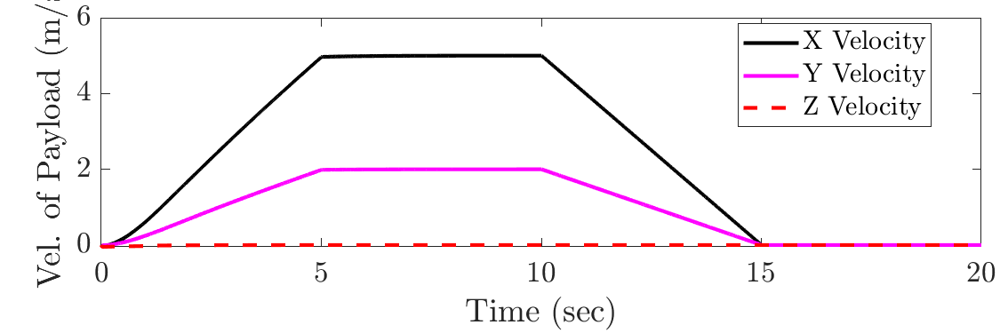

#### Contact Force on the Payload
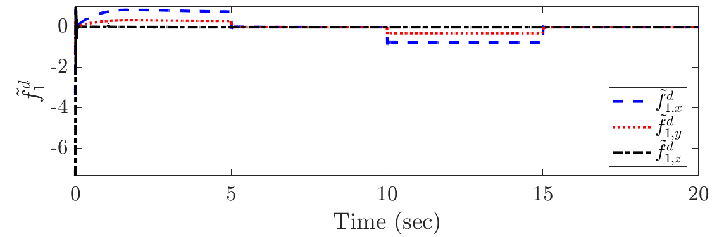

#### Non-linear Adaptive Geometric Control
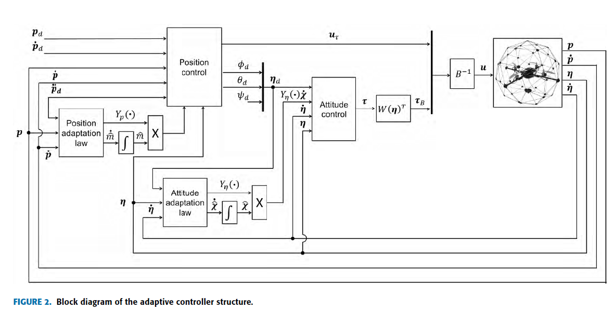
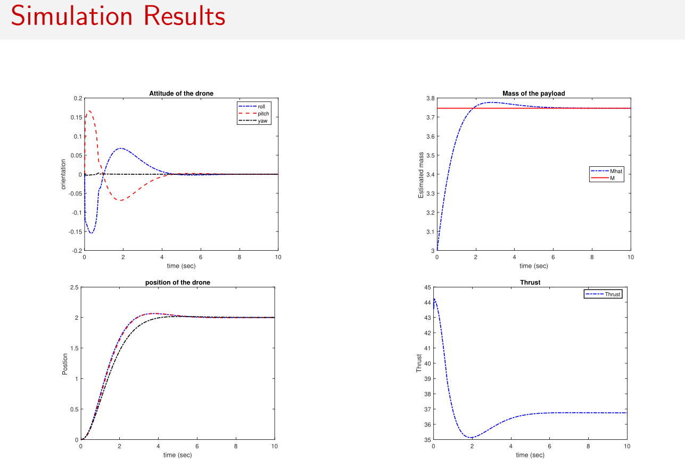

### Autonomous Vehicle Planning and Control
Research at Ford Motor Company, Research & Advanced Engineering (advisor: Dr. H. Eric Tseng, NAE Member).

* Continuous-curvature (clothoid-based) path planner and **nonlinear rear-wheel feedback lateral controller** for autonomous parallel parking and auto-hitch (SAE L2/L3).
* State machines and **control-barrier-function safety certificates** for autonomous function transitions and fault handling.
* Trajectory-tracking benchmarks (pure-pursuit, LQR, PD, backstepping, nonlinear feedback); validated in simulation and on dSPACE real-time hardware.

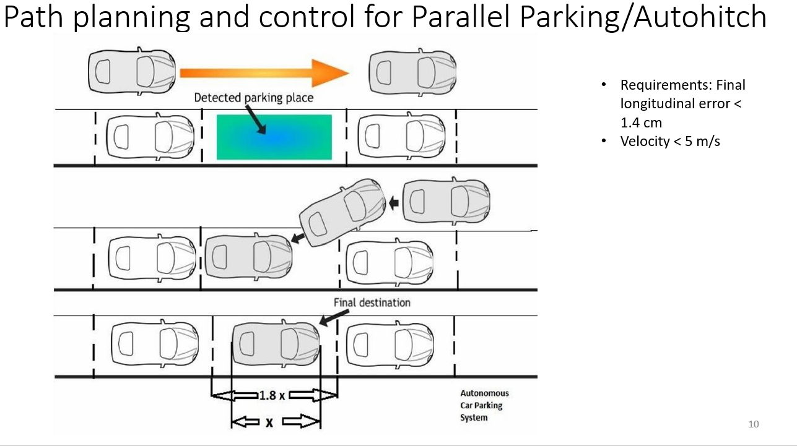

#### Clothoid-Based Path Planning
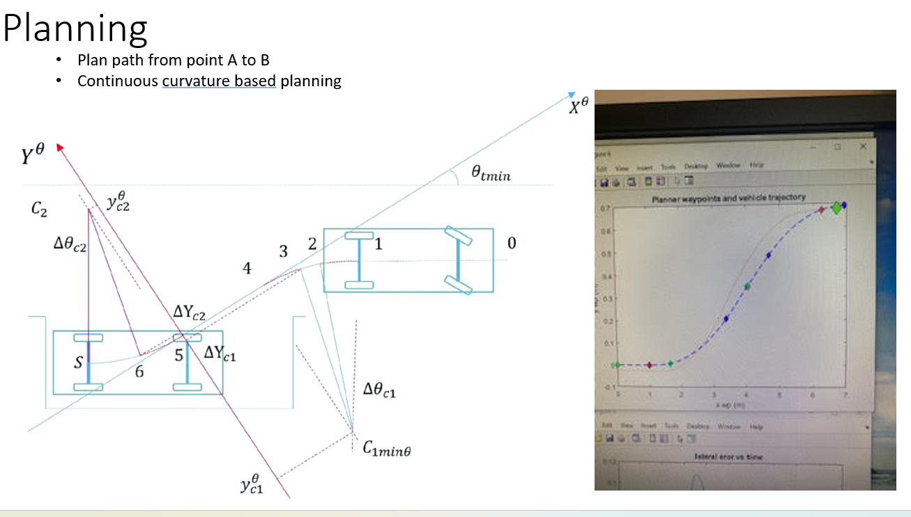

#### Non-linear Rear-Wheel Feedback Control
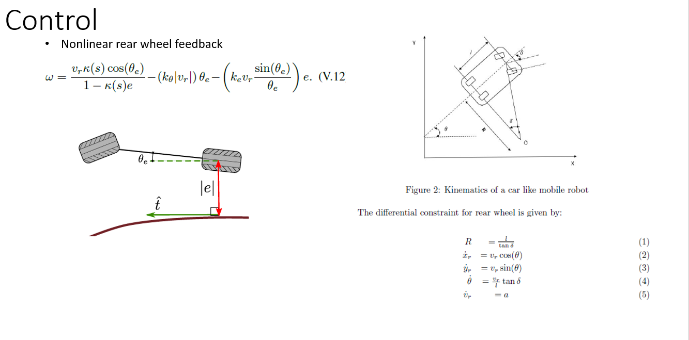
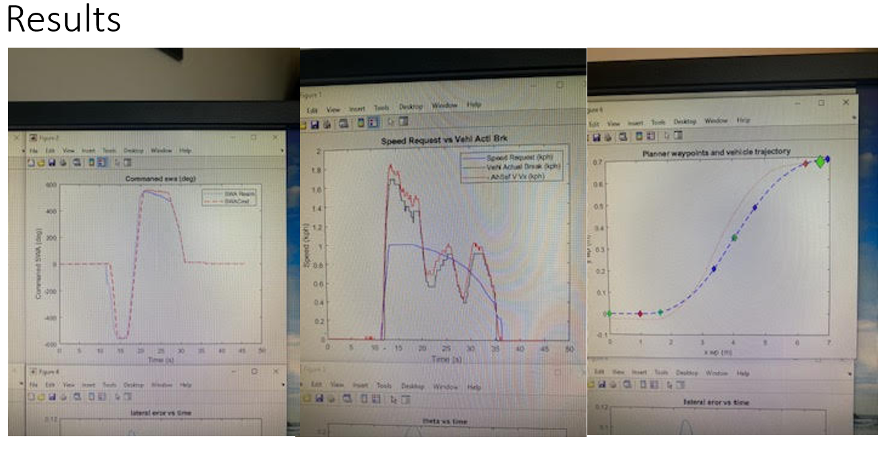

#### Vehicle Dynamics with Cruise and Lateral Control
<video width="100%" controls autoplay loop muted>
  <source src="../images/Vehicle_Dynamics_and_Cruise_Control.mp4" type="video/mp4">
  Your browser does not support the video tag.
</video>

#### Pure-Pursuit Control
<video width="100%" controls autoplay loop muted>
  <source src="../images/pure_pursuit.mp4" type="video/mp4">
  Your browser does not support the video tag.
</video>

---

## Background

* **M.S., Mechanical & Aerospace Engineering** — Oklahoma State University, 2018 (Control Theory & Robotics; advisor Dr. He Bai)
* **B.S., Mechanical Engineering** — McNeese State University, 2015

**Experience:** Visiting Researcher, UT Arlington (present) · Tech Lead & Senior Controls Research Engineer, Amogy · Research Engineer (Autonomous Driving), Ford R&A · Senior Controls Engineer, The Drone Racing League · Graduate Research Assistant, Oklahoma State University.

Full details are on my [CV](/cv/).

**Contact:** thapasandesh1@gmail.com
