I am a robotics and controls research engineer working on **safety-critical control and motion planning for dynamic systems**. My work pairs rigorous theory with hands-on validation on real hardware, driven by one conviction: **safety is the bottleneck for deployment of physical AI systems**.

<!-- built on one conviction: **safety is the central bottleneck to deploying physical AI** -->
I believe the best ideas come by bridging the gap between theory and application - turning mathematical models into robust, practical systems that move the world toward full autonomy. Having worked in academic research and industrial research, I bring a unique blend of deep theoretical foundations paired with hands-on insights into solving engineering problems from the ground up using first principles. I believe algorithms should be intuitive and practical to implement in real-time systems.

Modern autonomous systems sit at an intersection of two established yet challenging paradigms. Model-based methods, including control barrier functions, Hamilton-Jacobi reachability, predictive safety filters, formal methods, and so on, provide strong state-space guarantees. However, this design often assumes an analytical model and idealized actuators and sensors. On the other hand, data-rich methods like reinforcement learning and learning-based perception have been successful in complex tasks yet cannot guarantee safety and remain one step away from failure for untrained events.

Real systems often reside at the intersection of these two methods and are dynamic. Can we design robot behaviors that can adapt dynamically to changing events while using learning-based methods for vision and planning? The answer is often a hybrid solution, developing novel constrained-optimization-based planning and control methods that can adapt dynamically and can also gurantee safety.

**My current research lies here, leveraging the mathematical properties of the dynamical system and control methods that utilize real-time data and online learning for safe control and planning of autonomous systems.**

**Research interests**
- Constrained control and optimization for motion planning, control and coordination 
- Safe control and learning, adaptive autonomy
- Decision-making under uncertainty
- Distributed and decentralized control, estimation, and multi-vehicle coordination

**Application Areas**: dynamic systems, UAVs, autonomous vehicles, multi-agents and robots

**Note : I did not use AI to create these sections**

I am currently a **Visiting Researcher** in the [ETAIC Lab](https://etaic.github.io) at the University of Texas at Arlington (host: Dr. H. Eric Tseng, )

**Updates** 
- Started Visiting Researcher Position at at [ETAIC Lab](https://etaic.github.io) , working in the inteesection of safe control and RL for robotics. 
- **C1.** Thapa S., Qi Z. *A Modular State-Machine Based Event PID Controller.* Submitted to the American Control Conference (ACC) 2027.
- **C2.** Thapa S., Tseng E. *A Feasible Entry Set for the Handoff between Global and Local Planners in Parallel Parking.* In preparation for submission to the American Control Conference (ACC) 2027.
- **T1.** Thapa S. *A Comparative Tutorial on Autonomous Quadrotor Trajectory Tracking Control: PID, State-Dependent LQR, Geometric SE(3), and Nonlinear Adaptive Control.* In preparation for arXiv release.

You can view my [publications](/publications/), [research](/research/), and [CV](/cv/) for details.
---

## Selected Research & Projects

* Auto-generated table of contents
{:toc}

## Current Research Projects 

### Multi-Agent RL and Safe Control — Current Research in Collaboration with Dr. Eric Tseng at UTA
- Multi-agent reinforcement learning for cooperative tasks, with a safety layer based on time-varying control barrier functions; implemented on Hugging Face-compatible microbot platforms, extending prior lab work on Unitree humanoid whole-body control.

### Control and Planning 

- Constrained Control and Planning for autonomous vehicles, certified handoff from a sampling-based planner to a local low-level geometric planner.
- Learning-based event-PID with safety guarantees.
<!-- 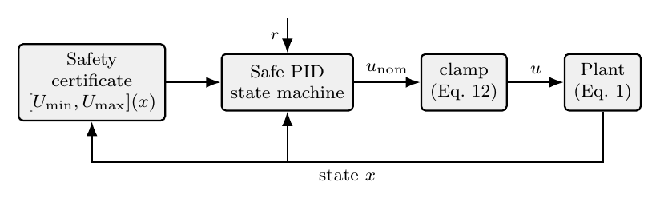 -->
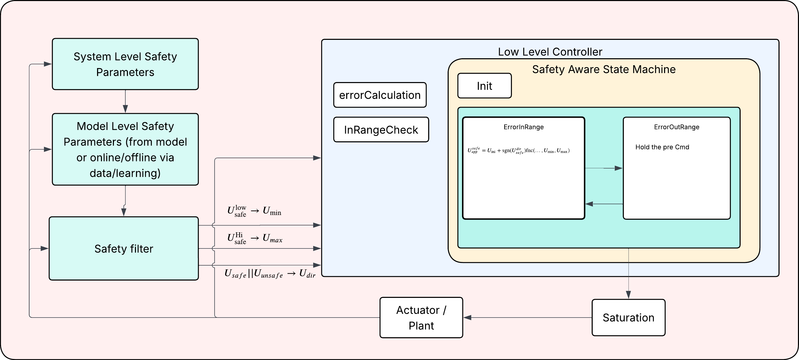

<video width="100%" controls autoplay loop muted>
  <source src="../images/Hybrid_Astar_Plannar_Ctrl_v5.mp4" type="video/mp4">
  Your browser does not support the video tag.
</video>

<!-- 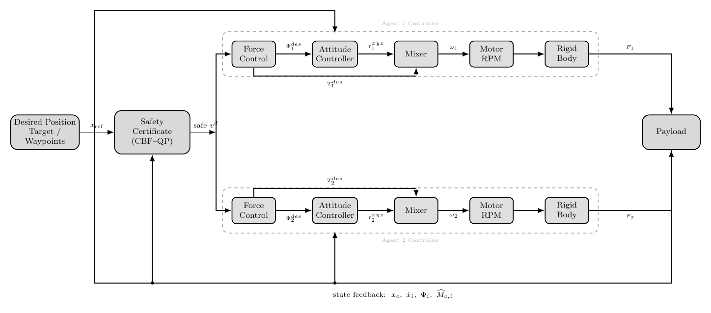 -->
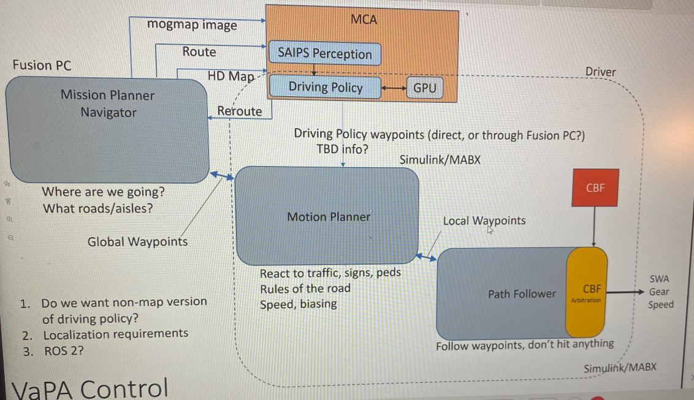

### Autonomous Quadrotor UAV Control
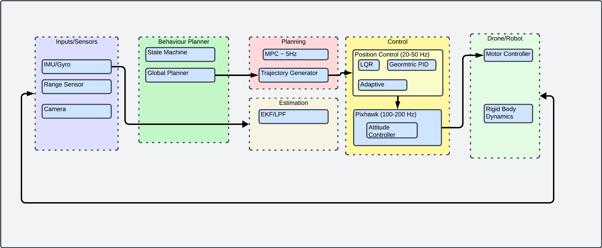

* Cascaded PID, state-dependent LQR, nonlinear Lyapunov-based, sliding-mode, backstepping, geometric SE(3), and Cartesian impedance controllers for quadrotor trajectory tracking.
* Geometric attitude control and differential-flatness-based minimum-snap trajectory generation.
* End-to-end autopilot integrating state estimation, planning, and control, validated in MATLAB/Simulink, Gazebo, PX4 SITL, ROS, and on real quadrotor hardware.

#### Cascaded PID Control in PX4
<video width="100%" controls autoplay loop muted>
  <source src="../images/PX4_PID_Control.mp4" type="video/mp4">
  Your browser does not support the video tag.
</video>

#### State-Dependent LQR for Trajectory Tracking
Full-state time-varying LQR designed and implemented in real time in Gazebo and PX4.

<video width="100%" controls autoplay loop muted>
  <source src="../images/LQR_control.mp4" type="video/mp4">
  Your browser does not support the video tag.
</video>

#### Offboard Velocity Control
<video width="100%" controls autoplay loop muted>
  <source src="../images/offboard_velocity_px4_gazebo.mp4" type="video/mp4">
  Your browser does not support the video tag.
</video>

#### Minimum-Snap 3D Trajectory Generation
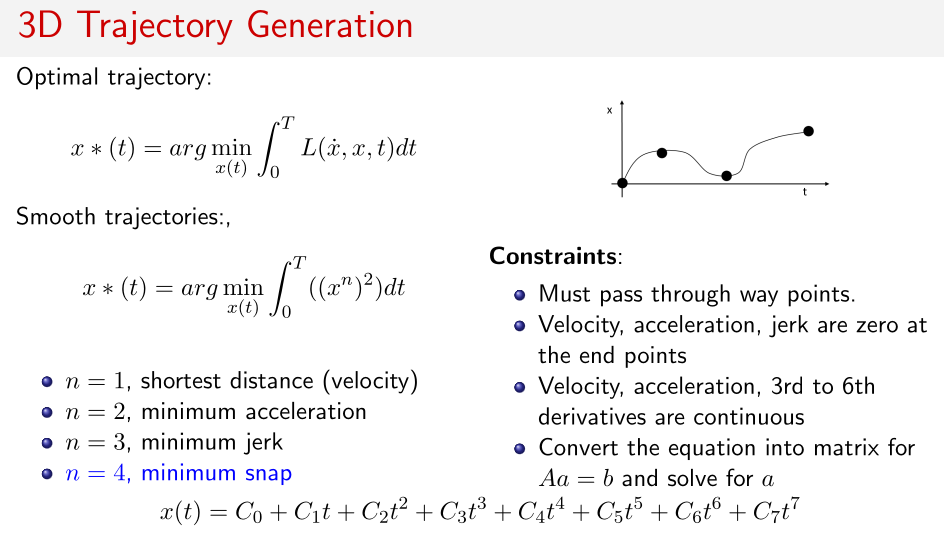

<video width="100%" controls autoplay loop muted>
  <source src="../images/Minimum_Snap_Trajectory_Generation_Simulation.mp4" type="video/mp4">
  Your browser does not support the video tag.
</video>

### Distributed Control, Coordination, and Manipulation
M.S. research at Oklahoma State University with Dr. He Bai (CoRAL Lab), jointly with Dr. J. Á. Acosta (University of Seville, Spain).

* Decentralized multi-robot control framework for cooperative aerial manipulation: multiple quadrotor UAVs transport a shared payload **without constant inter-robot communication**.
* Adaptive force-sharing controllers regulate payload forces while all agents coordinate their motion, with stable transport under unknown payload mass and external disturbances — validated in simulation and physical flight tests.

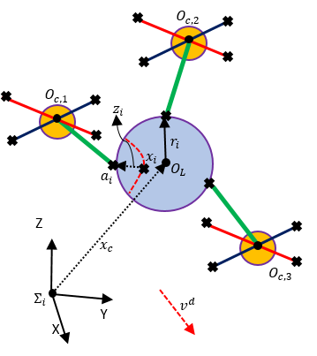

**Related publications:**
* **[J2]** Thapa S., Bai H., Acosta J.A. *Cooperative Aerial Manipulation with Decentralized Adaptive Force-Consensus Control.* Journal of Intelligent & Robotic Systems (JINT), 2020.
* **[C1]** Thapa S., Bai H., Acosta J.A. *Cooperative Aerial Load Transport with Attitude Stabilization.* American Control Conference (ACC), 2018.
* **[C2]** Thapa S., Bai H., Acosta J.A. *Force Control in Cooperative Aerial Manipulation.* IEEE ICUAS, 2018.
* **[C3]** Thapa S., Bai H., Acosta J.A. *Cooperative Aerial Load Transport with Force Control.* IFAC NAASS, 2018.

#### Cooperative Manipulation of an Unknown Payload
<video width="100%" controls autoplay loop muted>
  <source src="../images/KnownMass5.mp4" type="video/mp4">
  Your browser does not support the video tag.
</video>

#### Cooperative Attitude Control
<video width="100%" controls autoplay loop muted>
  <source src="../images/Anim_new_control.mp4" type="video/mp4">
  Your browser does not support the video tag.
</video>

#### Cooperative Control with Time-Varying Velocity

  <iframe width="560" height="315"
  src="https://www.youtube.com/embed/tDgRc_d6Nqo"
  title="Cooperative control with time-varying velocity"
  frameborder="0"
  allow="accelerometer; autoplay; clipboard-write; encrypted-media; gyroscope; picture-in-picture; web-share"
  allowfullscreen>
  </iframe>

#### Aerial Manipulator Flight Test

  <iframe width="560" height="315"
  src="https://www.youtube.com/embed/vBqVEjUz4NM"
  title="Aerial manipulator flight test"
  frameborder="0"
  allow="accelerometer; autoplay; encrypted-media; gyroscope; picture-in-picture"
  allowfullscreen>
  </iframe>

### Learning for Control and Estimation
* **Concurrent-learning** adaptive control for a team of robots transporting a common load, enabling real-time estimation of unknown parameters (payload mass and drag) while driving all agents and the payload to a desired trajectory.
* Guarantees parameter convergence and improves transient performance by reusing past data to relax excitation requirements, with accurate force regulation and synchronized motion in simulation.

* **[J1]** Thapa S., Self R., Bai H., Kamalapurkar R. *Cooperative Manipulation of an Unknown Payload with Concurrent Mass and Drag Force Estimation.* IEEE Control Systems Letters (L-CSS), with CDC presentation option, 2019.

#### Drag Force Estimation
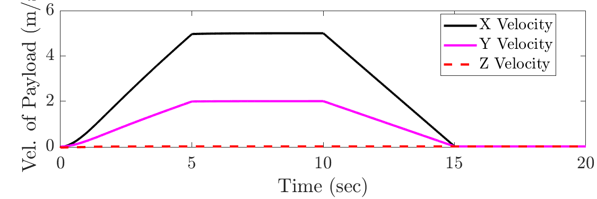

#### Contact Force on the Payload
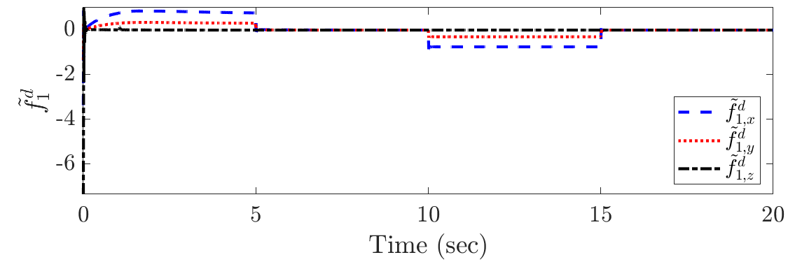

#### Non-linear Adaptive Geometric Control
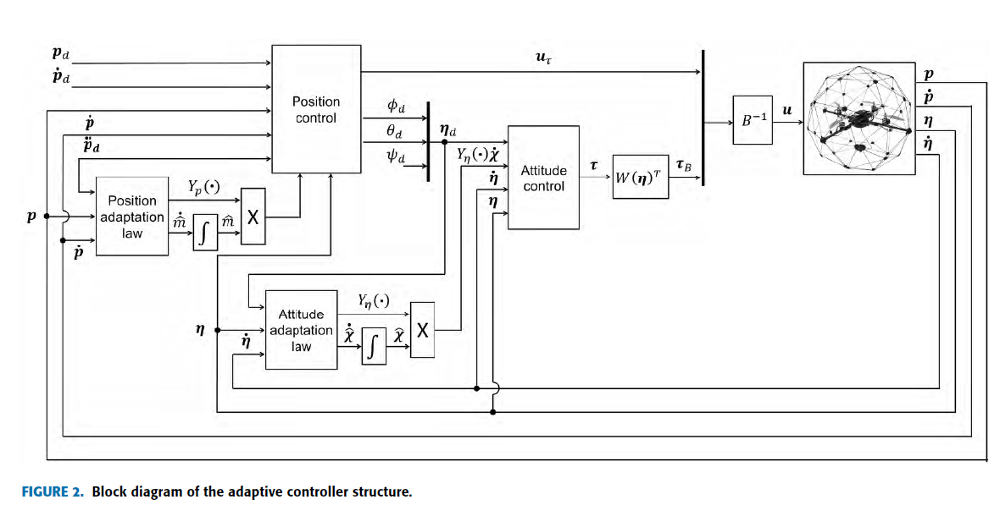
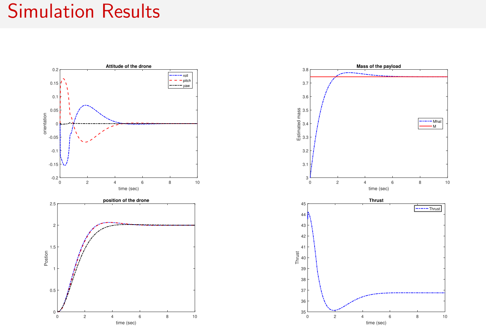

### Autonomous Vehicle Planning and Control
Research at Ford Motor Company, Research & Advanced Engineering (advisor: Dr. H. Eric Tseng, NAE Member).

* Continuous-curvature (clothoid-based) path planner and **nonlinear rear-wheel feedback lateral controller** for autonomous parallel parking and auto-hitch (SAE L2/L3).
* State machines and **control-barrier-function safety certificates** for autonomous function transitions and fault handling.
* Trajectory-tracking benchmarks (pure-pursuit, LQR, PD, backstepping, nonlinear feedback); validated in simulation and on dSPACE real-time hardware.

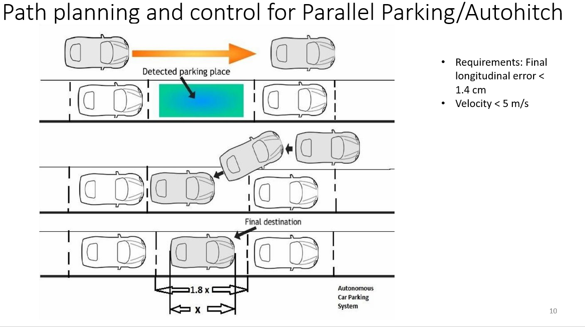

#### Clothoid-Based Path Planning
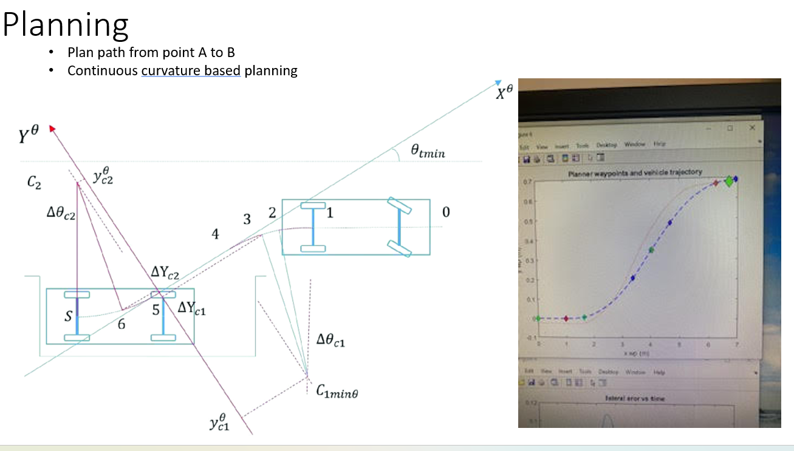

#### Non-linear Rear-Wheel Feedback Control
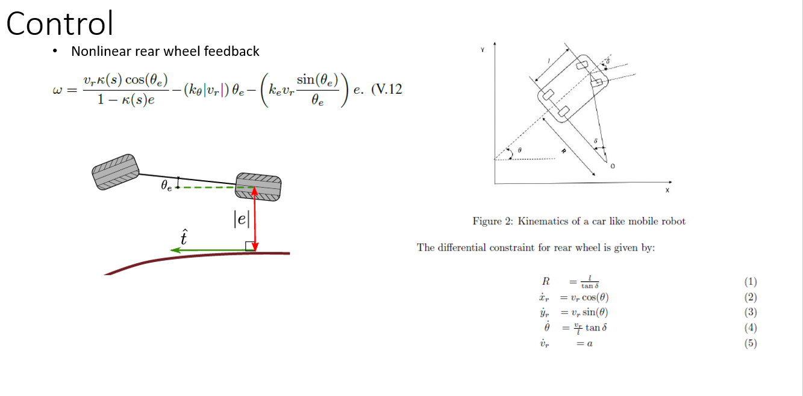
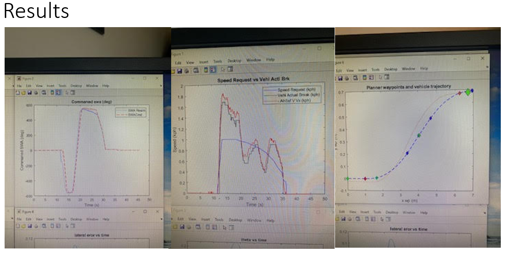

#### Vehicle Dynamics with Cruise and Lateral Control
<video width="100%" controls autoplay loop muted>
  <source src="../images/Vehicle_Dynamics_and_Cruise_Control.mp4" type="video/mp4">
  Your browser does not support the video tag.
</video>

#### Pure-Pursuit Control
<video width="100%" controls autoplay loop muted>
  <source src="../images/pure_pursuit.mp4" type="video/mp4">
  Your browser does not support the video tag.
</video>

---

## Background

* **M.S., Mechanical & Aerospace Engineering** — Oklahoma State University, 2018 (Control Theory & Robotics; advisor Dr. He Bai)
* **B.S., Mechanical Engineering** — McNeese State University, 2015

**Experience:** Visiting Researcher, UT Arlington (present) · Tech Lead & Senior Controls Research Engineer, Amogy · Research Engineer (Autonomous Driving), Ford R&A · Senior Controls Engineer, The Drone Racing League · Graduate Research Assistant, Oklahoma State University.

Full details are on my [CV](/cv/).

**Contact:** thapasandesh1@gmail.com
