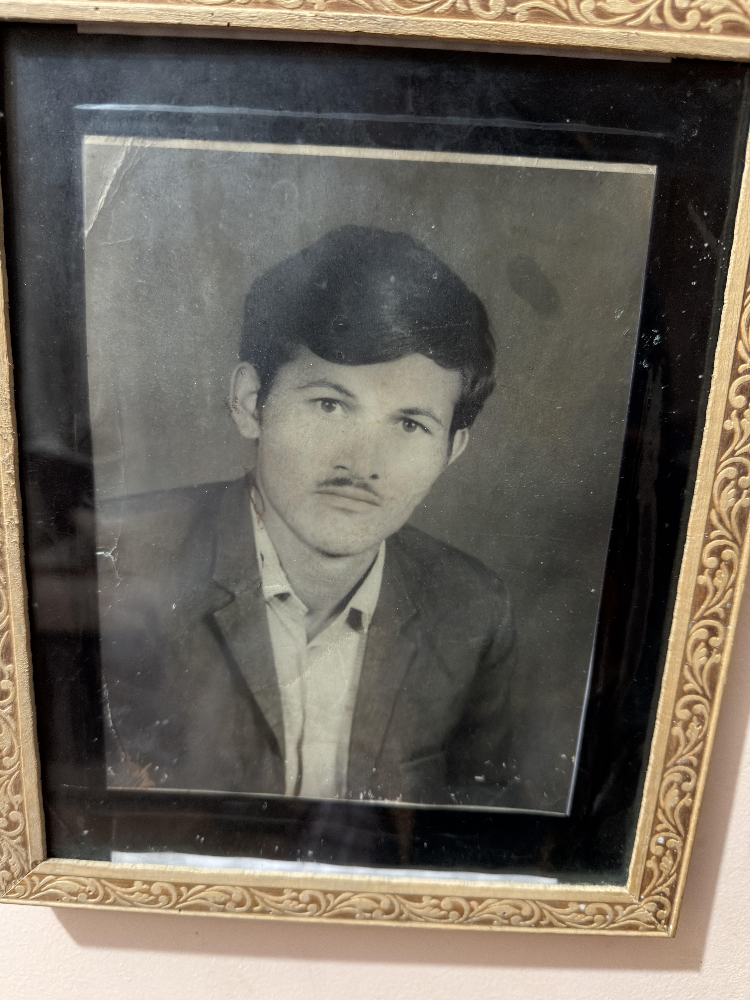

## In Memory of My Father

<figure style="text-align:center; margin:0 auto 1.5em;">
  
  <figcaption><em>My father — teacher, social worker, and public servant.</em></figcaption>
</figure>

Earlier this year I lost my father — a teacher, social worker, and public servant, and a beloved figure in his hometown in Nepal, who devoted his life to making the world around him better. He taught me that quiet perseverance and service to others matter more than any title, and his spirit lives on through me in everything I do.

Because of the COVID pandemic and my own health struggles, I was unable to travel home to see him for years, and I never had the chance to say a proper goodbye. That is a grief I will always carry.

To my father: I will spend the rest of my life making you proud.

## My Journey

The past few years have tested me. I spent more than a year recovering from long COVID — an illness that reshaped my plans and forced me to step back from opportunities I had worked hard for. Visa and immigration complications compounded the difficulty and, together with the pandemic and my health, kept me from returning home to Nepal to be with my family and my father.

I share this because I believe mental health matters as much as professional success. Through all of it I have kept going — grateful to everyone who has supported me, rebuilding, resilient, and still looking forward to solving hard problems in safety-critical controls and robotics.

*With gratitude,*
*Sandesh*
